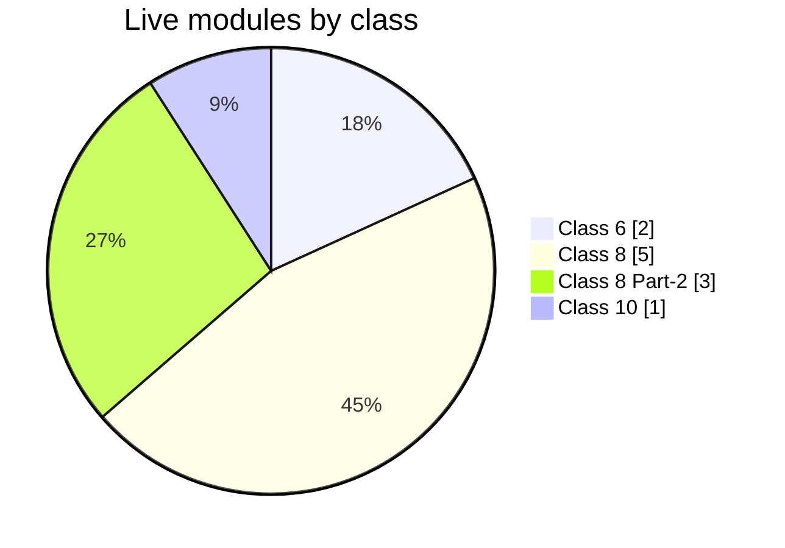
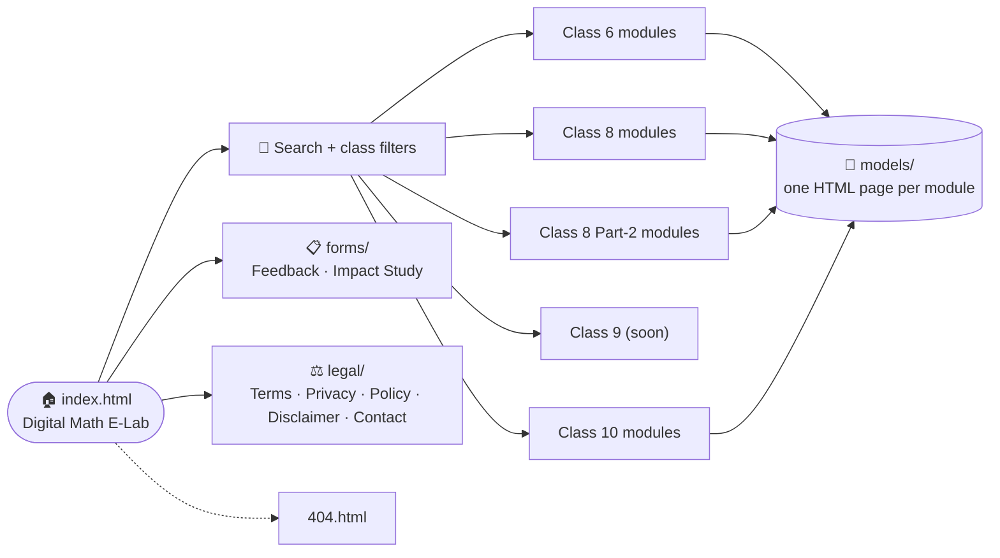

<p align="center">
  
</p>

<p align="center">
  <a href="https://github.com/Muniramm890/E-LAB">
    
  </a>
</p>

<p align="center">
  
  
  
  
  
</p>

---

## 🔬 About

**Digital Math E-Lab** is a collection of interactive conceptual simulations and drafting models for **NCERT Mathematics**. Each module turns one chapter into something students can drag, draw, test and watch change live, instead of only reading it in a textbook.

It was developed at the **Regional Institute of Education (NCERT), Ajmer** under the PAC Programme.

### ✨ What you get on the home page

| Feature | Details |
| :-- | :-- |
| 🔎 **Live search** | Find a module by topic, such as *Quadrilaterals* or *Polynomials* |
| 🎓 **Class filters** | One tap for All Classes, Class 6, Class 8, Class 9 or Class 10 |
| 🧩 **Module cards** | Class badge, chapter number, description and a Launch button |
| 🌙 **Dark theme** | Navy, sky blue and gold design, responsive on phone and desktop |
| 📋 **Forms** | Feedback form and an Impact Study form (GeoGebra) |
| ⚖️ **Legal pages** | Contact & credits, terms, privacy, user policy and disclaimer |

---

## 📊 Coverage at a glance



| Class | Live | Coming soon |
| :-- | :--: | :--: |
| Class 6 | 2 | 1 |
| Class 8 | 5 | 0 |
| Class 8 Part-2 | 3 | 0 |
| Class 9 | 0 | 1 |
| Class 10 | 1 | 0 |
| **Total** | **11** | **2** |

---

## 🧩 Modules

### Class 6

| Chapter | Module | What you can do | Status |
| :--: | :-- | :-- | :--: |
| 08 | **Playing with Constructions Lab** (two versions) | Virtual ruler, compass and protractor board: circles, squares and rectangles, step-by-step constructions, diagonals and equidistant points with live drafting | ✅ Live |
| 07 | **Interactive Fractions Builder** | Pie-chart and fraction-strip builder to compare, add and subtract fractions | 🔜 Soon |

### Class 8

| Chapter | Module | What you can do | Status |
| :--: | :-- | :-- | :--: |
| 01 | **Squares & Cubes Visualizer** | See N² and N³ geometrically: L-shaped gnomons, odd-number sums, 3D volume growth | ✅ Live |
| 02 | **Power Play: Exponents Lab** | Fold paper toward the Moon, explore every law of exponents, scientific notation, scale from 10⁰ to 10²⁵, plus a quiz arena | ✅ Live |
| 03 | **A Story of Numbers** | 4,000 years of counting: tally, Roman, Egyptian, any base, Mesopotamian, Mayan, Chinese rods and Hindu place value, plus a quiz | ✅ Live |
| 04 | **Quadrilaterals Drafting Lab** | Angle-sum property, parallelograms, rhombus, kites and rectangles with live geometry proofs | ✅ Live |
| 05 | **Letter Number Play Lab** | Sums of consecutive numbers, divisibility shortcuts, digital roots and cryptarithms | ✅ Live |

### Class 8 · Part 2

| Chapter | Module | What you can do | Status |
| :--: | :-- | :-- | :--: |
| 01 | **Fractions in Disguise** (Interactive Fractions Visualizer) | Pie-chart and fraction-strip builder for comparing, adding and subtracting fractions | ✅ Live |
| 02 | **The Baudhāyana–Pythagoras Theorem Lab** | Square doubling and halving, Śulba-Sūtra integer triples, and a dynamic a² + b² = c² area proof | ✅ Live |
| 03 | **Proportional Reasoning – II Lab** | Multi-variable work-rate problems, inverse variation and gear ratios, live speed-time-distance graphs | ✅ Live |

### Class 9

| Chapter | Module | What you can do | Status |
| :--: | :-- | :-- | :--: |
| 03 | **Cartesian Coordinate Explorer** | Plot points on a 2D plane, identify quadrants and understand distance | 🔜 Soon |

### Class 10

| Chapter | Module | What you can do | Status |
| :--: | :-- | :-- | :--: |
| 02 | **Polynomial Zeroes Visualizer** | Plot quadratic parabolas and see roots as x-axis intercepts in real time | ✅ Live |

---

## 🗺️ How the site is organised



---

## 📁 Repository structure

```text
E-LAB/
├── .github/
│   └── workflows/                         # GitHub Actions workflows
├── assets/                                # Shared site assets
├── forms/
│   ├── feedback.html                      # Feedback form
│   └── Impact-Study-GeoGebra.html         # Impact study form
├── legal/
│   ├── contact.html                       # Contact & credits
│   ├── terms.html                         # Terms & conditions
│   ├── privacy.html                       # Privacy policy
│   ├── policy.html                        # User policy
│   └── disclaimer.html                    # Disclaimer
├── models/
│   ├── class6-playing-with-constructions.html
│   ├── Playing with Constructions.html
│   ├── class8-squares-cubes.html
│   ├── class8-power-play.html
│   ├── class8-story-of-numbers.html
│   ├── class8-quadrilaterals.html
│   ├── class8-letter-number-play.html
│   ├── class10-polynomials.html
│   └── class-8/
│       └── part-2/
│           ├── chapter-01-fractions-in-disguise.html
│           ├── chapter-02-baudhayana-pythagoras.html
│           └── chapter-03-proportional-reasoning.html
├── 404.html                               # Not-found page
└── index.html                             # Home page: search, filters, module cards
```

---

## 🚀 Run locally

No build step is needed. It is a static site.

```bash
git clone https://github.com/Muniramm890/E-LAB.git
cd E-LAB

# Option 1: open index.html in your browser
# Option 2: serve it locally
python -m http.server 8000
# then visit http://localhost:8000
```

### ➕ Add a new module

1. Create the module page in `models/`, for example `models/class9-coordinate-geometry.html`.
2. In `index.html`, copy an existing `<article class="card class-9">` block, then update the class badge, chapter number, title, description and the `href` of the Launch button.
3. Add a few keywords to its `data-title` attribute so search can find it.

---

## 🙌 Credits

Developed at the **Regional Institute of Education (NCERT), Ajmer** under the PAC Programme.

Original concept, UI/UX design and source code by **[Muni Ram Meena](https://github.com/Muniramm890)**.

© 2026 Muni Ram Meena. All Rights Reserved.

<p align="center">
  
</p>
